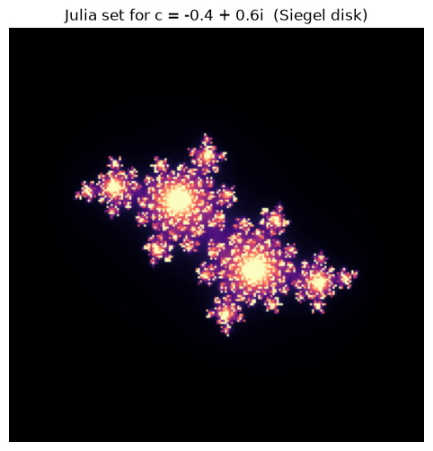

[](https://github.com/LucasEsq/fractal-lab/actions/workflows/ci.yml)

# fractal-lab

> Interactive fractal education for Jupyter notebooks.

Most fractal libraries are *renderers*. `fractal-lab` is a **teaching tool**.
Each lesson is one function call that opens an interactive widget exploring
a single mathematical idea — with the reasoning behind it written out,
not just the picture.

## Gallery

Every lesson is a runnable notebook with a rendered preview. Click any
image to open the notebook directly on GitHub — no install required.

### Lesson 1 — What does `c` actually do?

[](notebooks/01_julia_explorer.ipynb)

A Julia set is the set of points `z` for which `z → z² + c` stays bounded.
The only thing that changes between two completely different Julia sets
is the complex number `c`. Drag the sliders and watch the set tear itself
apart and re-form.

The notebook also walks through **what's happening under the hood**: how
"iterate a point" becomes "color a grid of pixels," why the escape-time
algorithm works, and what the critical orbit of `z = 0` has to do with
the shape you see.

## Quickstart

```bash
pip install fractal-lab[interactive]
